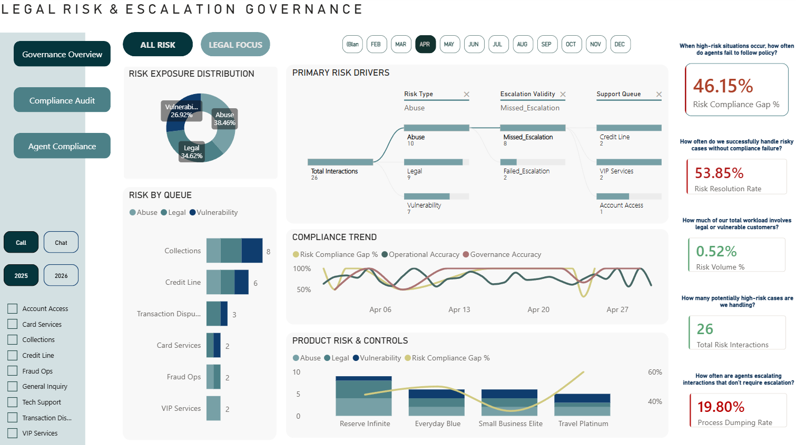
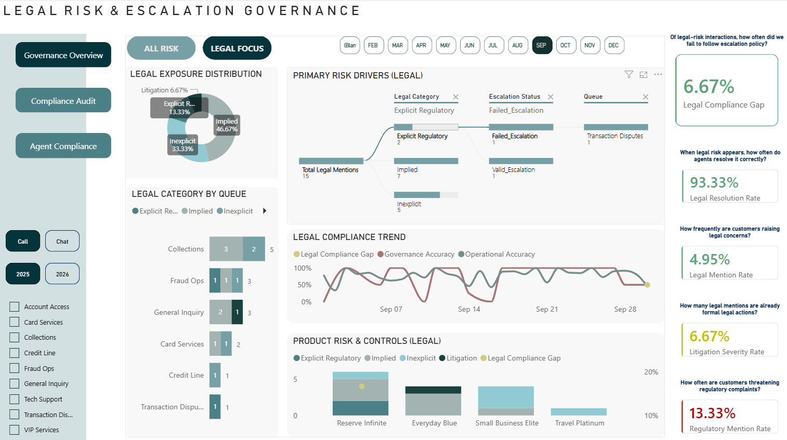
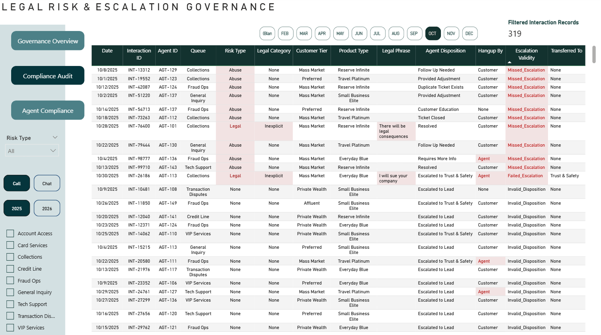
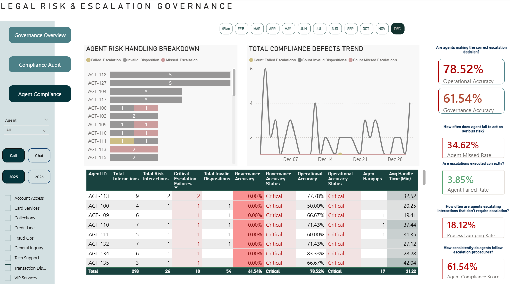

# Contact Center Legal Risk & Escalation Governance

## Overview

This project is a high-fidelity **Legal Risk & Escalation Governance System** designed for a financial services contact center.

It demonstrates how raw operational data can be transformed into a structured, audit-ready governance framework used to:

* Detect high-risk customer interactions (Legal, Vulnerability, Abuse)
* Monitor escalation control failures in real time
* Evaluate agent compliance and process dumping behaviors
* Support regulatory oversight (CFPB, BBB, FTC)
* Enable targeted coaching and internal audit workflows

**Note on Data Privacy**

Because banking and regulatory data is highly sensitive, this project uses a custom-built Python simulation engine to generate a synthetic dataset of 5,000 records.
The data reflects realistic operational patterns, agent tenure–based error rates, and legal phrase taxonomies without compromising confidentiality.

## Data Engineering: The Simulation Engine

To create a realistic auditing environment, I developed `dataset_generation.ipynb` using Python (Pandas, NumPy, Faker). The engine doesn't just randomize data; it applies **weighted business rules**:

* **Queue-Based Risk Weighting:** Queues like 'Collections' and 'Fraud' have a statistically higher probability of legal triggers compared to 'General Inquiry.'
* **Tenure-Based Failure Injection:** The simulation applies a higher probability of escalation failure (Missed/Failed) to agents with <6 months of tenure, simulating a realistic training gap.
* **Malicious Behavior Simulation:** Injected "Process Dumping" (Invalid Dispositions) where agents use escalation tags on normal calls to reduce their workload, and "Agent Hangups" specifically during high-friction legal threats.

---

## Business Problem

In highly regulated environments, failures in escalation especially involving litigation threats and consumer rights, can lead to:

* Regulatory penalties (CFPB / OCC fines)
* Legal exposure (unaddressed lawsuits)
* Customer harm (failure to identify vulnerable customers)
* Reputational damage

Most operational dashboards focus on efficiency (e.g., Average Handle Time).

This project focuses on **control effectiveness, compliance outcomes, and governance risk.**

---

## Technical Challenges & DAX Engineering

### The Denominator Mismatch Problem

Early versions of the dashboard experienced “metric spill,” where rates exceeded 100%.

This occurred due to:

* Numerators and denominators pulling from different filter contexts
* Decomposition Tree cross-filtering
* The “Accuracy Paradox” caused by dominant low-risk interactions

---

### The Defensible Solution

A nested DAX framework was implemented using:

* VAR logic
* KEEPFILTERS
* Centralized risk universe definitions

This locks all governance metrics to validated risk interactions.

#### Example: Risk Compliance Gap Logic

```dax
Risk Compliance Gap % =
VAR RiskFailures =
CALCULATE(
[Total Risk Interactions],
KEEPFILTERS('Interactions'[escalation_validity] IN {"Missed_Escalation","Failed_Escalation"})
)
RETURN
DIVIDE(RiskFailures, [Total Risk Interactions], 0)
```

This guarantees that compliance gaps remain mathematically valid.

---

## Dashboard Architecture

The Power BI solution is organized into three functional layers.

---

### 1. Governance Overview
Executive-level monitoring of organizational risk exposure.
* **Primary Risk Drivers:** A Decomposition Tree for root-cause analysis.
* **Threshold-Based Alerts:** KPI cards turn Red/Yellow based on the percentage density of risk, providing a unified governance signal.

Key Features:

* Risk and legal exposure distributions
* Primary Risk Drivers (Decomposition Tree)
* Compliance and accuracy trends
* Product risk analysis
* Threshold-based KPI alerts

Bookmark Views:

* All Risk / Legal Focus
* Call / Chat channels

### Governance Overview — All Risk



---

### Governance Overview — Legal Focus




---

### 2. Compliance Audit
Audit-ready interaction review for quality assurance and investigation.
* **Evidence Tracking:** Captures the specific legal phrase or vulnerability trigger for auditor review.
* **Hangup Detection:** Identifies agents who disconnected calls during legal threats.
  
Key Features:

* Row-level interaction logs
* Conditional formatting for failures
* Hangup detection on legal calls
* Legal phrase evidence tracking
* Transfer validation



---

### 3. Agent Compliance
Performance and coaching analytics for frontline staff.
* **Governance Accuracy Status:** A dynamic rating system (Excellent to Critical) that protects against "Null" data false alarms.
* **Coaching Prioritization:** Identifies agents with high "Missed Escalation" rates.

Key Features:

* Agent risk handling breakdown
* Compliance defect trends
* Governance accuracy scoring
* Process dumping detection
* Coaching prioritization




---

## Executive Summary of Findings

This project uncovered four critical operational risks that traditional efficiency metrics failed to surface. These insights provide a defensible roadmap for regulatory remediation.

### 1. The Tenure Paradox (Digital Complacency)
* **Finding:** Audit data revealed that **100% of missed legal escalations** in Chat channels were attributed to agents with **6+ months of tenure**. 
* **Insight:** Veteran agents exhibit "skimming" behavior in multi-chat environments, prioritizing speed over the detection of subtle, implied legal triggers.

### 2. The Collections Crisis (Year-Over-Year Drift)
* **Finding:** The **Collections** queue compliance gap surged from **11% in 2025 to 20% in 2026**, despite legal volume remaining steady at 36%.
* **Insight:** This indicates a systemic breakdown in internal controls rather than a change in customer behavior, requiring an immediate policy audit.

### 3. Operational Waste (Process Dumping)
* **Finding:** The **Invalid Disposition Rate** sits at **17.5%**, representing **875 unnecessary escalations**.
* **Labor Impact:** At an average specialist handle time of 30 minutes, this represents **~437.5 hours of wasted senior labor** per period, resources that should be redirected to litigation defense.

### 4. Zero-Tolerance Failures (Malicious Hangups)
* **Finding:** Identified **18 confirmed risk interactions** where agents disconnected the call. **8 of these** involved direct legal threats.
* **Insight:** Concentration in the Collections and Credit Line queues suggest "avoidance behavior" during high-friction interactions, posing a severe regulatory risk.

---

## Dataset Design & Risk Taxonomy

The dataset was engineered in Python to simulate worst-case regulatory risk scenarios.

### Risk Categories

| Category      | Examples                                        |
| ------------- | ----------------------------------------------- |
| Legal         | Implied threats, regulatory filings, litigation |
| Vulnerability | Financial hardship, medical distress, eviction  |
| Abuse         | Harassment, hostility, threats                  |

---

### Governance Rules

Each interaction is classified into one of the following outcomes:

* Valid_Escalation — Correct identification and routing
* Missed_Escalation — Risk present, no action taken (highest risk)
* Failed_Escalation — Escalation attempted but ineffective
* Invalid_Disposition — Process dumping behavior
* No_Escalation_Required — Normal interaction
* Review_Needed — Manual review required

These classifications power all compliance metrics.

---

## Key Metrics

### System-Level

* Risk Compliance Gap %
* Operational Accuracy
* Governance Accuracy
* Risk Volume %

### Legal Risk

* Legal Compliance Gap
* Legal Resolution Rate
* Legal Mention Rate
* Litigation Severity Rate
* Regulatory Mention Rate

### Agent Performance

* Agent Compliance Score
* Missed Escalation Rate
* Failed Escalation Rate
* Invalid Disposition Rate
* Agent Hangups
* Average Handle Time

---

## Technology Stack

* Python (Pandas, NumPy, Faker)
* Power BI
* DAX
* GitHub

---

## Repository Structure

```text
contact-center-risk-governance/
│
├── dashboard/          # Power BI dashboard files
│   └── Legal Risk & Escalation Governance.pbix
│
├── data/               # Synthetic data & generation scripts
│   ├── Interactions.csv
│   └── dataset_generation.ipynb
│
├── docs/               # Technical & governance documentation
│   ├── data_dictionary.md
│   ├── dax_library.md
│   └── findings_recommendations.md
│
├── screenshot/         # Dashboard screenshots
│   ├── agent_compliance.png
│   ├── compliance_audit.png
│   ├── governance_overview_all_risk.png
│   ├── governance_overview_legal_focus.png
│
├── README.md           # Project overview
└── LICENSE             # MIT License
```
---

## How to Use This Repository

1. View the Dashboard
   Download the `.pbix` file from the `dashboard/` folder.

2. Review the Logic
   See `docs/` for DAX measures and governance rules.

3. Explore the Data
   The Python generator script is included in the repository.

---

## Limitations

* Data is fully synthetic
* No live regulatory systems are connected
* Legal references are simulated
* Metrics are designed for demonstration purposes

These constraints are intentional to preserve confidentiality.

---

## Future Enhancements: Phase 2 (Structural Entropy & Governance Scalability)

The next phase of this project moves beyond static auditing into **Dynamic Environment Management**, simulating the real-world "horror" of cross-functional data dependency and shifting business rules. This phase focuses on modeling organizational complexity rather than data cleanliness,
reflecting the primary source of failure in mature enterprise environments.

### 1. Definition Drift & Policy Versioning
* **Objective:** Simulate a mid-year shift in Legal taxonomies (e.g., a stricter definition of "Vulnerability").
* **Technical Goal:** Implement a **Policy Versioning Table** to prevent "Metric Drift" and show how the dashboard handles mathematically incompatible year-over-year definitions without breaking.

### 2. Multi-Channel Silo Divergence (LOB Splits)
* **Objective:** De-couple Chat and Call escalation processes. Launch a "Platinum Shopper" LOB with unique compliance triggers that differ from "Legacy Blue" workflows.
* **Technical Goal:** Build a **Unified Governance Mapping** layer to reconcile disparate department rules into a single, site-wide Risk Score.

### 3. Training-to-Audit Feedback Loops
* **Objective:** Integrate messy, siloed "Agent Recertification" data from Training teams to identify the correlation between "Training Decay" and recent compliance failures.
* **Technical Goal:** Create a "Compliance vs. Recency" scatter plot to predict when an agent moves from "Low Risk" to "Zero-Tolerance Liability."

### 4. Advanced Economic Impact Modeling
* **Objective:** Move from "Labor Waste" calculations into **Regulatory Penalty Projections**.
* **Technical Goal:** Assign weighted dollar values to specific "Legal Mention" categories based on historical CFPB/FTC fine averages to project total "At-Risk Dollars."
  
---

## Author

Kristine Soliman <br>
Data & Operations Analyst | Chandler, AZ  
